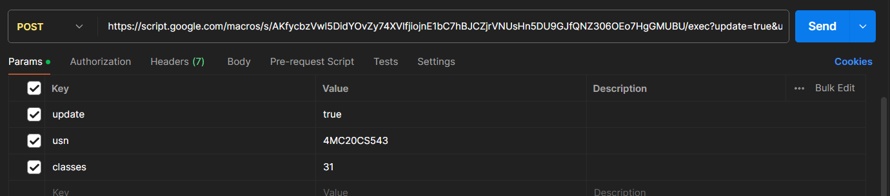
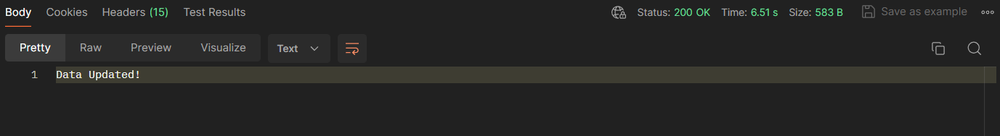

# POST - Update Data

## Creating API Using Apps Script

1. Open `google sheets as DB.xlsx` in google sheets.

2. In the top navbar go to `Extensions` and then click `Apps Script`.

3. Copy the flie contents from `doPost.gs` to your file in Apps Script.

4. Deploy as a `new deployment` in `web app`.

5. copy the `URL`.

## Testing the API using POSTMAN

> Replace with your copied URL

inside params update=true the usn to be updated and the updated classes count.

>Data updated in Google Sheets
