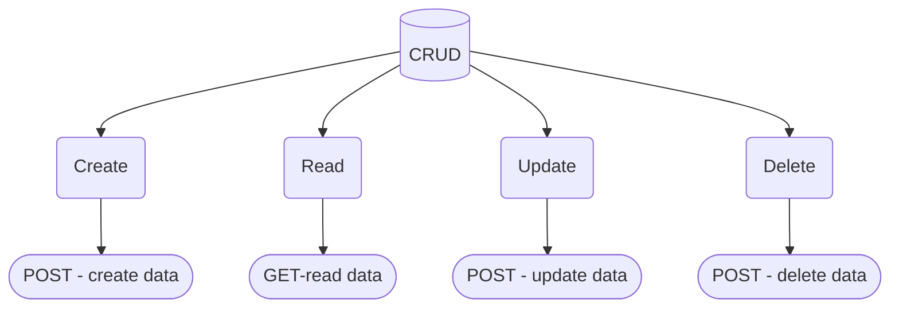

# Use `Google Sheets` as a `DATABASE` for your *project's prototype*.

 

> [!NOTE]
> This repository contains only the creation and testing of API.

 

 

## CRUD operations , leaf nodes are files in the root of this repo.

 
 

> Won a hackathon because we were the fastest to complete a working prototype

