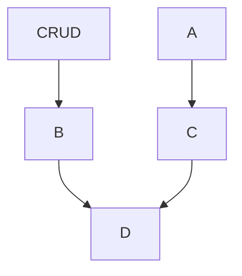

### Use `Google Sheets` as a `DATABASE` for your *next project*.
> [!NOTE]
> Useful information that users should know, even when skimming content.

```mermaid
graph TD;
    CRUD-->B;
    A-->C;
    B-->D;
    C-->D;
```
