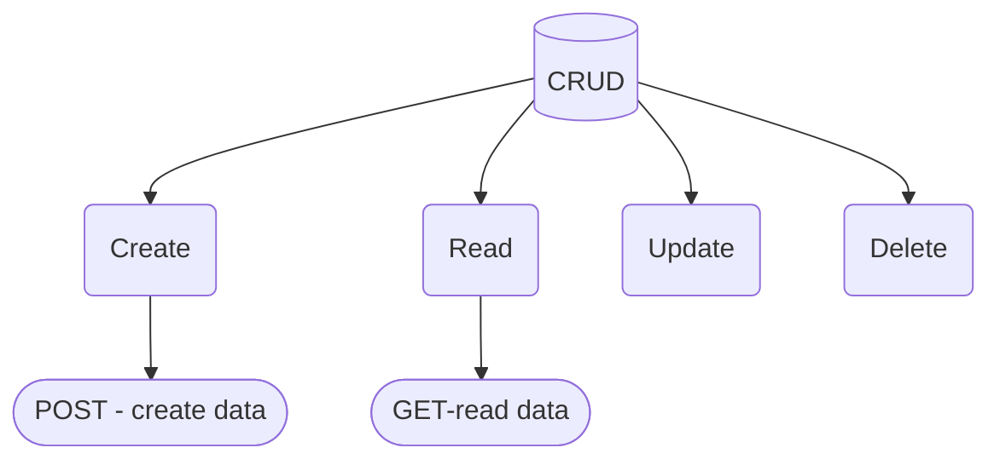

### Use `Google Sheets` as a `DATABASE` for your *project's prototype*.
> [!NOTE]
> Useful information that users should know, even when skimming content.

```mermaid
graph TD;
    id1[(CRUD)]-->id2(Create);
    id1-->id3(Read);
    id1-->id4(Update);
    id1-->id5(Delete);
    id3-->id6([GET-read data]);
    id2-->id7([POST - create data]);
```
